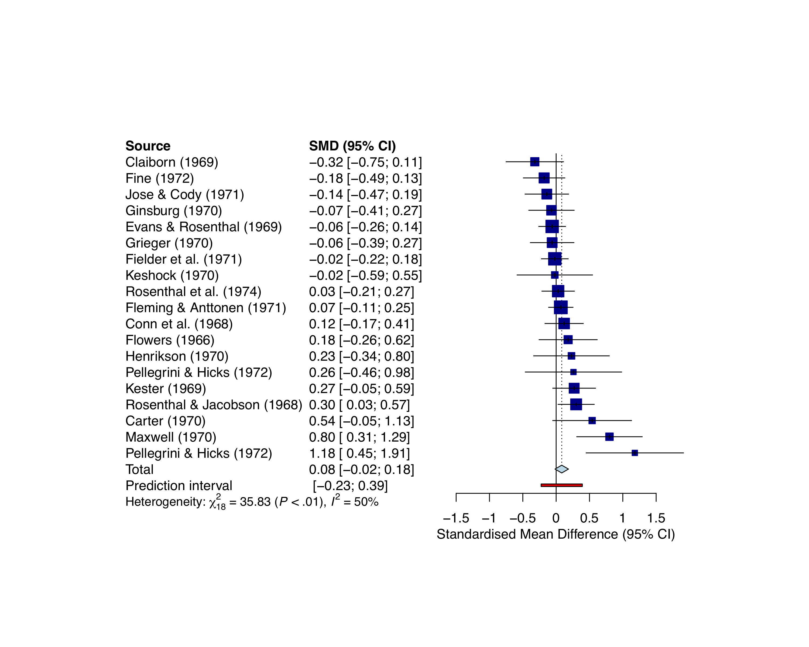

## Questions.


The data for this question are standardized mean differences from a meta-analysis of 49 experimental effects of teacher expectancy on pupil IQ (Raudenbush, 1984). They are part of the `metafor`package and you can find out more about them in the help file in the metafor package. 

The typical study in this dataset administered a pre-test to a sample of students. Subsequently, the teachers were told that a randomly selected subsample were 'bloomers' (students with substantial potential intellectual growth). All of the students were then administered a post-test and it was expected that the ones identified as bloomers would show a significantly higher increment in IQ growth than the control group (i.e., students not identified as bloomers). You might have heard of the [Pygmalion effect](https://www.duq.edu/about/centers-and-institutes/center-for-teaching-excellence/teaching-and-learning/pygmalion), (see [here](https://en.wikipedia.org/wiki/Pygmalion_in_the_Classroom))

Inspect the data and note that it has _yi_= standardized mean difference and _vi_= corresponding sampling variance. 

* Conduct a fixed-effects meta-analysis. Note that you'll need to calculate the standard error.
* Conduct a random-effects model with the **DerSimonian-Laird** method.
* Conduct a random-effects model with the **Hartung-Knapp-Sidik-Jonkman** method.
* Conduct a random-effects model with **Restricted Maximum Likelihood (REML)** estimation, look at the `meta` package, if you don't know how to.
* Make a 'nice' forest plot for one of your models. (**Bonus**: see if you manage to combine author and year on your forest plot).

## Load and manipulate the data

There are 19 studies.

```{r}
library(meta)
library(metafor)
Data<-dat.raudenbush1985
head(Data)
```

I have made the names as in our slides. Note that this is unnecessary duplication (as TE = _yi_ ) but then it maps on nicely to our code.

```{r}
library(dplyr)
Data <- Data %>% mutate(TE=yi, seTE=sqrt(vi))
```


## Fixed effects model

```{r}
Fixed<-metagen(TE,
        seTE,
        data=Data,
        studlab=paste(author),
        comb.fixed = TRUE,
        comb.random = FALSE,
        prediction=TRUE,
        sm="SMD")
```

These results map on to what is reported in Raudenbush et al. (2009): the effect size estimate is .06, with a 95 %CI from -.01 ,_z_ = 1.66 , _p_ = .098. Note that there is significant heterogeneity, e.g., _Q(18)_= 35.83, _p_ = .007.

```{r}
Fixed
```

## Random effects model (DL method)

Perhaps unsurprisingly one would draw same the fundamental conclusion that there is no significant effect (though note this analysis the effect is estimated to be slightly larger .0893 vs. .0604).

```{r}
Random_dl<-metagen(TE,
        seTE,
        data=Data,
        studlab=paste(author),
        comb.fixed = FALSE,
        comb.random = TRUE,
        hakn = FALSE,
        sm="SMD")
Random_dl
```

## Random effects model (Hartung-Knapp-Sidik-Jonkman method)

When this correction is applied we see that the confidence interval is somewhat widened, compared to when no correction is applied.

```{r}
model_hksj<-metagen(TE,
        seTE,
        data=Data,
        studlab=paste(author),
        comb.fixed = FALSE,
        comb.random = TRUE,
        method.tau = "SJ",
        hakn = TRUE,
        prediction=TRUE,
        sm="SMD")
model_hksj
```

## REML estimation.

This is REML estimation which maps on Table 16.2 (Simple Random Effects model) (as an aside, note $\tau^2$ estimate in this model as opposed to the above).

```{r}
model_reml<-metagen(TE,
        seTE,
        data=Data,
        studlab=paste(author),
        comb.fixed = FALSE,
        comb.random = TRUE,
        method.tau = "REML",
        hakn = FALSE,
        prediction=TRUE,
        sm="SMD")
model_reml
```

## Forest plot.

Let's combine, author and year. 

Let's bracket the year as per convention. Here I rely on base R and [this snippet](https://stackoverflow.com/questions/29884082/apply-parentheses-around-elements-of-r-dataframe).

```{r}
Data$year_b <- paste0("(", format(unlist(Data[,3])),")")
```

Then we combine as done in [here](https://stackoverflow.com/questions/18115550/combine-two-or-more-columns-in-a-dataframe-into-a-new-column-with-a-new-name). Here I have opted for a '[tidyverse](https://www.tidyverse.org/)' solution.

```{r}
library(tidyverse)
Data <-Data %>% unite(author_year, c(author, year_b), sep = " ", remove = FALSE)
```

Let's redo our model but now with `author_year`.

```{r}
model_reml2<-metagen(TE,
        seTE,
        data=Data,
        studlab=paste(author_year),
        comb.fixed = FALSE,
        comb.random = TRUE,
        method.tau = "REML",
        hakn = FALSE,
        prediction=TRUE,
        sm="SMD")
model_reml2
```

Note that this is but one solution.

Unfortunately this doesn't fit nicely, unless you mess about with the chunk options in `knitr`. So let's also export it as .pdf . Have a look at the `meta` manual manual, you can modify a bunch of other things.

```{r, fig.width=5,fig.height=5}
forest(model_reml2,
       sortvar=TE,
       xlim = c(-1,2),
       rightlabs = c("SMD","95% CI","weight"),
       leftlabs = c("Author", "SMD", "SE"),
       pooled.totals = FALSE,
       smlab = "",
       text.random = "Overall effect",
       print.tau2 = FALSE,
       col.diamond = "darkblue",
       col.diamond.lines = "black",
       col.predict = "black",
       print.I2.ci = TRUE,
       digits.sd = 2
)
```

```{r}
pdf(file='forestplot_pygmalion.pdf',width=10,height=8) 
forest(model_reml,
       sortvar=TE,
       xlim = c(-1,2),
       rightlabs = c("SMD","95% CI","weight"),
       leftlabs = c("Author", "N","Mean","SD","N","Mean","SD"),
       lab.e = "Intervention",
       pooled.totals = FALSE,
       smlab = "",
       text.random = "Overall effect",
       print.tau2 = FALSE,
       col.diamond = "darkblue",
       col.diamond.lines = "black",
       col.predict = "black",
       print.I2.ci = TRUE,
       digits.sd = 2
)
```

Note that there is some unnecessary duplication in the plot but it seems that 'leftlabs' cannot be modified easily... .

Here is an example of using 'JAMA'. 

```{r}
pdf(file='JAMA_forestplot_pygmalion.pdf', width=10,height=8) 
forest(model_reml2,
       sortvar=TE,
      layout='JAMA'
)
```

You should get something like below.

```{r, out.width = "5000px", echo=FALSE, fig.align='center'}

```

## The end.

The end.

```{r, out.width = "400px", echo=FALSE}
knitr::include_graphics("https://media.giphy.com/media/AGOPaltgJ2pBC/giphy.gif") # giphy.com fair use.
```

## Acknowledgments and further reading... .

The example is from [here](http://www.metafor-project.org/doku.php/analyses:raudenbush2009#fixed-effects_model). 


Note that throughout I have varied the rounding when I reported, you should make your own decisions on how precise you believe your results to be. 

Please see the slides for further reading.

**Cited literature**

Raudenbush, S. W. (1984). Magnitude of teacher expectancy effects on pupil IQ as a function of the credibility of expectancy induction: A synthesis of findings from 18 experiments. _Journal of Educational Psychology, 76(1)_, 85–97.

Raudenbush, S. W. (2009). Analyzing effect sizes: Random effects models. In H. Cooper, L. V. Hedges, & J. C. Valentine (Eds.), _The handbook of research synthesis and meta-analysis_ (2nd ed., pp. 295–315). New York: Russell Sage Foundation.

```{r}
sessionInfo()
```

